# 🎯 Awesome-Sales-Prospecting

  

  
  
  
  
  
  

## 🚀 Top Sales Prospecting Platforms & B2B Intelligence Ecosystem

**Curated List of SaaS Products & Open-Source GitHub Projects for Sales Prospecting, B2B Contact Data, Lead Enrichment & Outbound Outreach**

*A comprehensive directory of tools for B2B contact data discovery, direct phone & email finders, company intelligence, buyer intent signals, automated list building, lead verification, and AI-driven outbound outreach.*

**Last updated: September 2026**

---

This repository tracks notable **SaaS platforms** and **open-source projects** for **Sales Prospecting and Sales Intelligence**. These tools empower sales representatives, SDRs, AEs, growth hackers, and GTM teams to identify target decision-makers, verify emails and direct phone dials, enrich account data, and automate personalized outbound sales pipelines.

**Popular Category Leaders** include ZoomInfo, Apollo.io, Lusha, Seamless.AI, Cognism, RocketReach, LeadIQ, UpLead, Snov.io, and Kaspr.

**Open-Source & Local Exploration**: True open-source 1:1 replacements for proprietary global B2B contact databases do not exist due to the continuous maintenance and licensing costs of commercial datasets. However, open-source projects excel at **web scraping, local business discovery, OSINT digital footprints, contact enrichment scripts, CRM workflow automation, and autonomous AI research agents**.

Contributions are always welcome! Feel free to open a pull request to add or update entries.

---

## 📑 Table of Contents

- [🏢 SaaS/Hosted Platforms](#-saashosted-platforms)
  - [📊 Market Size & Industry Structure](#-market-size--industry-structure)
  - [📋 SaaS Platforms Comparison Table](#-saas-platforms-comparison-table)
- [💻 Open-Source GitHub Projects](#-open-source-github-projects)
  - [⭐ Curated Repositories](#-curated-repositories)
  - [🛠️ Key Open-Source Approaches & Workflows](#️-key-open-source-approaches--workflows)
- [🤝 How to Contribute](#-how-to-contribute)
- [⭐ Star History](#-star-history)
- [⚖️ Disclaimer](#️-disclaimer)

---

## 🏢 SaaS/Hosted Platforms

### 📊 Market Size & Industry Structure

> 💡 **Market Size & Structure**: The global **Sales Intelligence & B2B Prospecting market is estimated at $4.4B – $5.4B in 2026** (projected to reach **$8.7B – $12.5B by 2033** at ~11% CAGR). The sector is **moderately fragmented**—anchored by established enterprise market leaders (such as ZoomInfo, Apollo.io, and LinkedIn Sales Navigator) while sustaining a vibrant, competitive ecosystem of specialized AI-driven prospecting engines, data enrichment waterfalls, and local intelligence specialists rather than a pure winner-take-all monopoly.

### 📋 SaaS Platforms Comparison Table

*Sorted descending by company size (Valuation / Market Cap / Revenue).*

| Platform | Description | Company Size (Valuation / Revenue) | Pricing (Starting Tier) | Free Tier / Trial Limits |
| :--- | :--- | :--- | :--- | :--- |
| **[ZoomInfo](https://www.zoominfo.com/)** | Enterprise-grade B2B data and intelligence platform with deep contact coverage, org charts, buyer intent, and GTM workflows. | **~$4.8B Market Cap** (Public: NASDAQ: ZI) • ~$1.24B ARR | **~$14,995/year** (~$1,250/mo) starting price for Professional tier (annual commitment required) | **ZoomInfo Lite**: Free plan with 10–25 credits/mo (requires business contact sharing); **14-day free trial** on request with ~25 credits. |
| **[Apollo.io](https://www.apollo.io/)** | All-in-one prospecting platform combining a large B2B contact database with sequencing, email tools, and basic intent signals. | **~$1.6B Valuation** (Series D Unicorn) • ~$100M+ ARR | **$49/user/month** (billed annually) or **$59/user/month** (billed monthly) for Basic plan | **Free forever plan**: 10,000 email credits/mo, 5 mobile number credits/mo (60/yr), 10 export credits/mo, and up to 2 active sequences. |
| **[Lusha](https://www.lusha.com/)** | Lightweight contact and company data tool with a browser extension for direct dial and email lookups on LinkedIn. | **~$1.5B Valuation** (Series B Unicorn) • ~$60M+ ARR | **$37.45/user/month** (billed annually) or **$49.95/user/month** (billed monthly) for Starter plan | **Free forever plan**: 40 credits/month (5 direct phone/email credits + 35 email lookups), 1 user seat. |
| **[Seamless.AI](https://seamless.ai/)** | Real-time search engine and contact-discovery engine for finding verified B2B emails, direct dials, and buyer intent. | **~$1.1B Valuation** (Series B Unicorn) • ~$50M+ ARR | **~$147/user/month** (billed annually, standard entry team package starts at ~$4,740/year) for Pro plan | **Free plan**: 50 lifetime credits granted upon registration (one-time allotment, does not refresh monthly). |
| **[Cognism](https://www.cognism.com/)** | B2B contact data platform specializing in GDPR-compliant global/European coverage and phone-verified mobile numbers (Diamond Data). | **~$500M Valuation** (Series C) • ~$70M+ ARR | **~$15,000/year** (~$1,250/mo) starting price for Standard tier (annual contract required) | **No self-serve free plan**; provides **25 free verified lead samples** / test lookups upon scheduling a product demo. |
| **[RocketReach](https://rocketreach.co/)** | Extensive contact database for looking up personal/work emails, direct phone numbers, and social profiles. | **~$300M Est. Valuation** (Profitable Bootstrapped) • ~$40M Revenue | **$33/month** (billed annually) or **$48/month** (billed monthly) for Essentials plan | **Free plan**: 5 free contact lookups/credits upon account sign-up (no credit card required). |
| **[LeadIQ](https://leadiq.com/)** | Prospecting capture tool that helps sales teams identify decision-makers and sync contacts directly into CRMs/sequencers. | **~$150M Valuation** (Series B) • ~$15M+ ARR | **$39/user/month** (billed annually) or **$49/user/month** (billed monthly) for Starter plan | **Free forever plan**: 50 credits/month for 1 user seat (1 credit = 1 email, 10 credits = 1 mobile phone lookup); **30-day free trial** of paid plans. |
| **[UpLead](https://www.uplead.com/)** | High-accuracy B2B database offering real-time email verification and verified direct phone dials. | **~$100M Est. Valuation** (Bootstrapped) • ~$20M Revenue | **$74/month** (billed annually) or **$99/month** (billed monthly) for Essentials plan (170 credits/mo) | **7-day free trial** with 5 verified contact credits and full platform search features (requires card activation). |
| **[Snov.io](https://snov.io/)** | Email finder, verifier, and drip-outreach automation platform with sales CRM and warm-up tools. | **~$50M Est. Valuation** • ~$12M Revenue | **$30/month** (billed annually) or **$39/month** (billed monthly) for Starter plan (1,000 credits, 5,000 recipients) | **Free forever plan**: 50 credits/month, 100 recipient emails/month, and 1 email warm-up slot (refreshes monthly). |
| **[Kaspr](https://www.kaspr.io/)** | LinkedIn-focused prospecting and enrichment Chrome extension for finding direct emails and phone numbers. | **~$30M+ Acquisition** (Subsidiary of Cognism) • ~$10M ARR | **$49/user/month** (billed annually) or **$65/user/month** (billed monthly) for Starter plan | **Free forever plan**: 5 phone credits/mo, 5 direct email credits/mo, 10 export credits/mo, and unlimited B2B email credits. |

---

## 💻 Open-Source GitHub Projects

**Open-source emphasis**: True open-source equivalents to large commercial B2B databases do not exist — the core value is proprietary, continuously validated data. Highly effective open-source projects focus on **scraping, local lead discovery, OSINT reconnaissance, enrichment scripts, browser automation, and AI research agents**.

### ⭐ Curated Repositories

*Sorted descending by GitHub star count.*

- **[browser-use/browser-use](https://github.com/browser-use/browser-use)**   
  ⚡ Open-source AI agent library making websites accessible for automated prospect research, web data extraction, and autonomous lead harvesting.

- **[sherlock-project/sherlock](https://github.com/sherlock-project/sherlock)**   
  🔎 Powerful OSINT tool to hunt down prospect social media accounts and digital profiles across 400+ social networks by username.

- **[twentyhq/twenty](https://github.com/twentyhq/twenty)**   
  🏆 Modern open-source CRM with pipeline management, lead prospecting workflows, custom objects, and API-first architecture.

- **[unclecode/crawl4ai](https://github.com/unclecode/crawl4ai)**   
  🕷️ High-speed, LLM-friendly open-source web crawler and scraper designed specifically for AI agent data pipelines and lead extraction.

- **[mendableai/firecrawl](https://github.com/mendableai/firecrawl)**   
  🔥 Turn entire company websites into clean, structured markdown and structured JSON for LLM-powered company intelligence and lead enrichment.

- **[smicallef/spiderfoot](https://github.com/smicallef/spiderfoot)**   
  🕸️ Automated OSINT and intelligence gathering platform for deep reconnaissance on domain names, IP addresses, emails, and company infrastructure.

- **[sundowndev/phoneinfoga](https://github.com/sundowndev/phoneinfoga)**   
  📱 Advanced information gathering and OSINT tool for international phone numbers — carrier lookup, VoIP detection, and footprinting.

- **[laramies/theHarvester](https://github.com/laramies/theHarvester)**   
  📧 Classic OSINT reconnaissance tool designed to gather corporate emails, employee names, subdomains, and public IPs from search engines and PGP servers.

- **[megadose/holehe](https://github.com/megadose/holehe)**   
  🔍 Email OSINT utility that verifies whether an email address is registered across 120+ online platforms without alerting the target.

- **[asiifdev/business-leads-ai-automation](https://github.com/asiifdev/business-leads-ai-automation)**   
  🤖 Open-source, self-hosted lead generation and GTM automation platform — Google Maps scraping, AI scoring, personalized outreach templates, and CRM.

- **[dariubs/awesome-lead-generation](https://github.com/dariubs/awesome-lead-generation)**   
  📚 Curated collection of lead generation frameworks, scrapers, tools, strategies, and growth resources.

- **[issacops/opencloser-v2](https://github.com/issacops/opencloser-v2)**   
  🖥️ Local-first open-source AI sales prospector with ICP building, automated company researcher, and cold outreach drafting on desktop.

- **[ishandutta2007/open-sales-gpt](https://github.com/ishandutta2007/open-sales-gpt)**   
  🧠 Open sales-intelligence and autonomous agent framework combining prospect research, automated data enrichment, and outbound synthesis.

---

### 🛠️ Key Open-Source Approaches & Workflows

- 🌐 **Target List Discovery**: Extract local business listings from Google Maps, corporate registries, and niche business directories via open web scrapers.
- ✉️ **Pattern & SMTP Email Verification**: Use open pattern-matching heuristics and SMTP ping tests to confirm address deliverability before sending campaigns.
- 🤖 **Local LLM Company Research Agents**: Deploy local AI agents to analyze target websites, product docs, and press releases to compose hyper-personalized cold outreach.
- 🔄 **Waterfall Enrichment Pipelines**: Chain multiple free and low-cost API endpoints to enrich domain records with key personnel data.
- 🎯 **Niche & Local Focus**: Focus open-source prospecting efforts where public registry data is freshest and hyper-local targeting yields maximum conversion.

> 💡 **Recommended Custom Architecture**: Discover prospects from open/public data ➔ Enrich via automated scrapers & free APIs ➔ Verify email/phone deliverability ➔ Score & prioritize ICP match ➔ Push to CRM / Sequencing Engine.

---

## 🤝 How to Contribute

1. 🍴 Fork the repository.
2. 📝 Add or update entries in `README.md` following the existing format.
3. 📌 Ensure descriptions are concise, accurate, and include relevant links (and pricing details if SaaS).
4. 🚀 Submit a pull request with a descriptive title and summary of changes.

⭐ **Star this repository** if you find it helpful for your sales and outbound operations!

---

## ⭐ Star History

---

## ⚖️ Disclaimer

- This repository is a **community-curated index** created for educational and informational purposes — it does not constitute an official endorsement.
- Sales prospecting tools process personal and commercial data. Always adhere strictly to relevant privacy laws and regulations, including **GDPR, CCPA, CAN-SPAM, and PECR**.
- Automated scraping or data extraction may violate the terms of service of third-party platforms (such as LinkedIn). Review applicable terms and legal guidelines before deploying scrapers.
- Data accuracy varies across providers — always verify contacts prior to high-volume outbound campaigns.

---

  <b>Built for SDRs, AEs, RevOps, and GTM teams who need verified prospect data and high-signal outbound pipelines.</b>

